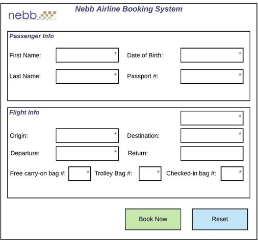

<h1># NebbAirline</h1>
<h2>Airline Booking System</h2>

Nebb Coding Project

HIGH-LEVEL GOAL
The high-level goal of the coding project is to implement a web-based application to book airplane tickets
for an airline company. The tool should enable listing, adding, editing, and deleting airplane tickets. The
company has a specific format for the tickets with required and optional data explained below.

TASK 1: WEB API
Create a .NET Core based RESTful API that will enable basic CRUD operations on airline tickets. The domain
model consists of one entity: an airline ticket. The entity properties can be extracted from the mockups
defined in TASK 2. The RESTful API should be implemented with the best software engineering practices
and design patterns in mind.

TASK 2: FRONTEND APPLICATION
Create a frontend application that will consume the RESTful API defined in TASK 1. The frontend application
should follow the latest software engineering practices and design patterns. The frontend application can
be built with MVC or any other frontend JavaScript/TypeScript framework. For the UI elements, any UI
framework can be used (Bootstrap, Material, etc.), and a ready-made template is acceptable. 
The
application should provide a user interface for the following use cases:

• List all flights;
• When a flight is clicked list flight information and all of the passengers for the flight (from the
submitted airline tickets);
• Add an airline ticket;
• Edit an airline ticket;
• Delete airline tickets.

Below is the mockup for creating (and editing) a ticket: 

Please make sure that the submitted assignment:

• Compiles and runs from Visual Studio;
• Handles any invalid input appropriately;
• Use Passport # for identifying passengers;
• Use Flight Code for identifying flights;
• When an existing value is inserted in the Passport # textbox prepopulate the empty fields with
the values for the existing passenger;
• When an existing value is inserted in the Flight Code textbox prepopulate the empty fields with
the values for the existing flight.
